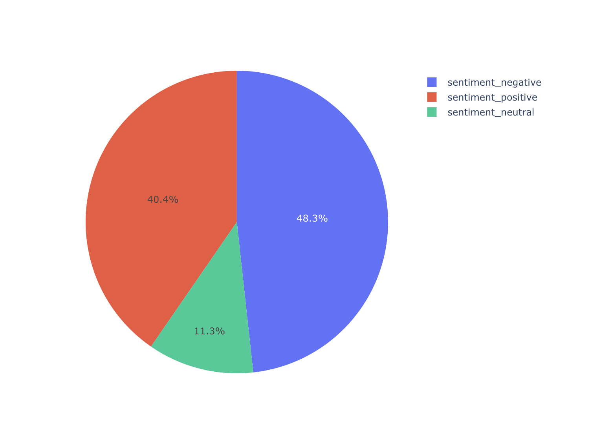
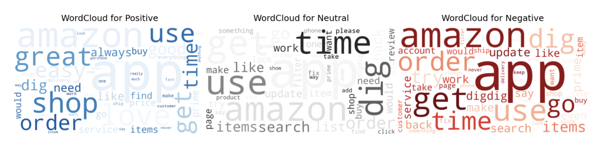
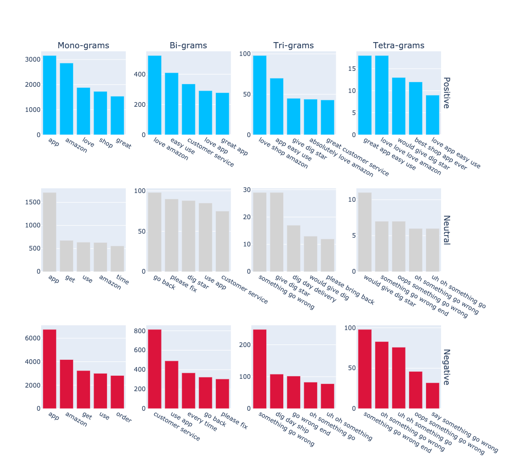
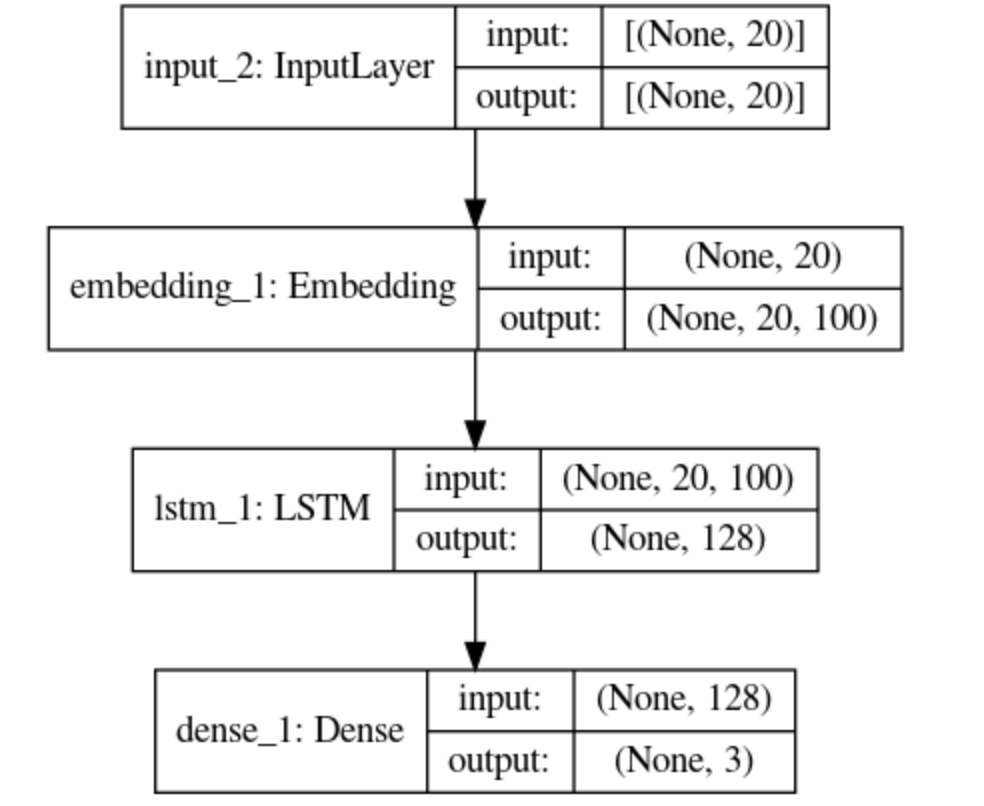
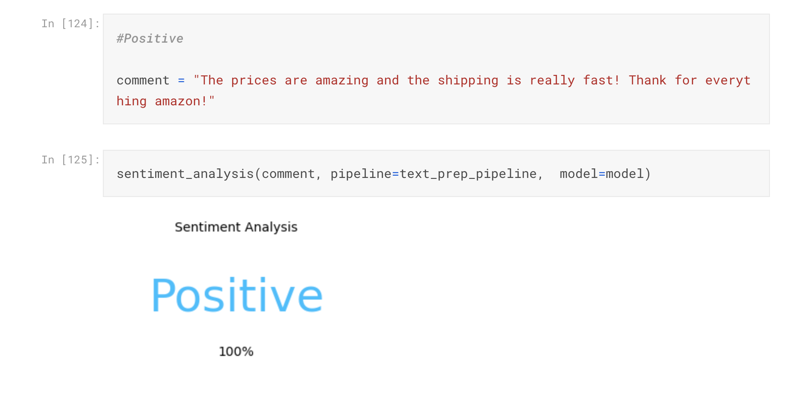
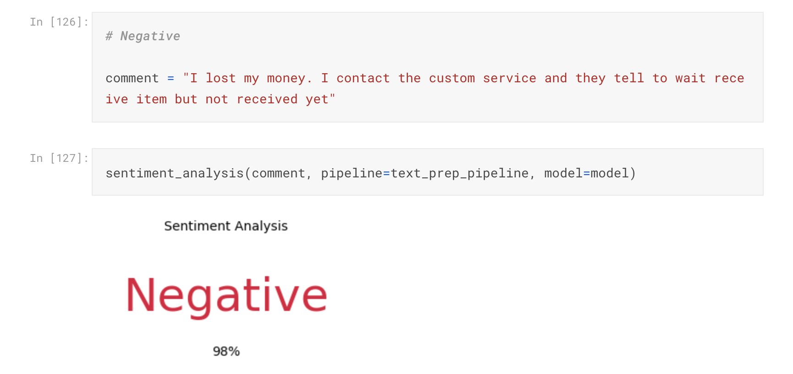
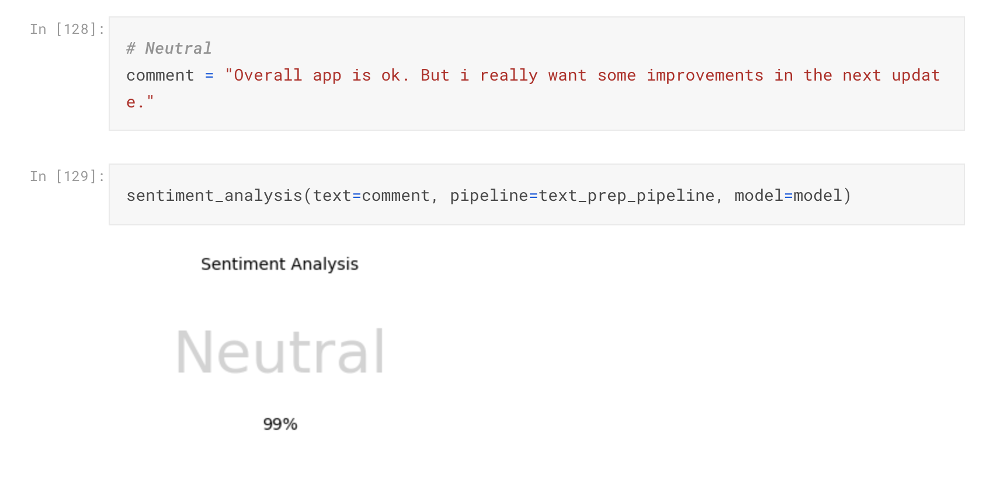

# Sentiment Analyse+Deep Learn - Amazon App

## Motivation

There is a lot of information available in the text format on the web. Reading that we can understand the sentiments about websites/products/brands. 
Here we will teach the computer to do the hard work of reading and understanding all of the reviews of Amazon for us. 
The objective of the project is to extract, manipulate and create a good deep learning model to understand the users' sentiments classifying texts sent by a human being into Positive, Neutral and Negative.

## Overview

Created a Sentiment Analysis with Deep Learning to recognise a sentiment in a text.
Scraped over 3000 reviews for Google Play Store and App Store using APIs 
Built a pipeline that text preprocessing the reviews and to bring them to  a form that is predictable and analyzable for the neural network.
Converted text inputs into embedded vectors using Global Vectors For Word (GloVe)
Built a sentiment analysis using keras modules Model , Dense, LSTM and Embedding.

## Resources Used

Python Version: 3.7 
Packages: pandas, numpy, google_play_scraper, app_store_scraper, re, unidecode, nltk, matplotlib, plotly, wordcloud, imblearn, sklearn, tensorflow.keras

## Text Preprocessing Pipeline

To build a pipeline for text preprocessing I built a few functions to do the following steps:
 * Lowercase the text and remove HTML
 * Remove accented characters
 * Extended contractions
 * Remove special characters
 * Lemmatization
 * Remove stop words
 * Check if is an english word and remove digits and duplicates white spaces.

For the pipeline I define 3 classes to apply all the text preprocessing previous functions on the reviews.
The first class will apply all the functions created to prepare the text into a regular expression. The second class will remove all the stop words and the last class will lemmatize the remnant words  of the previous processes.

## Plot

For a good understanding of the Amazon reviews I plotted the text in three different ways.

* Using pie graph I plotted the distribution
 

 

* The Word Cloud
 

 

* Lastly I plotted the n-gram. One bar chart for 1 grams, 2 grams, 3 grams and 4 grams of each sentiment.
 

 

## Modeling

Before I built the deep learning model, I went through a few steps. I splitted the data frame into Train and Test. Second, I vectorized and embedded the reviews and in order to prevent overfitting I balanced the Train set and also reduced the amount of features of it. Next, I created 3 functions of metrics that will be used into the model.
 
I built a Deep Learning model with one input layer shape 20. One Embedding Layer that takes the vocab size and the embedding matrix created before. One Long Short-Term Memory (LSTM) layer with 128 neurons and finely the output layer with 3 neurons since we have 3 labels in the output, Positive, Neutral and Negative. So, that's the final model.
 

 

## Results 

The training and validation shows very good results and are both always close to each other. Also the model keeps improving each epoch. When I evaluated in the testing df I reached the following scores:

* Loss: 0.600444 
* Accuracy: 0.742218 
* Precision: 0.754194 
* Recall: 0.731821 
* F1-Score: 0.742558 

For the final test I build a function that applies our pipeline for text preprocessing and classifies a comment with our model and returns if the comment is Positive, Negative or Neutral.
 

 

 

 

 

 

